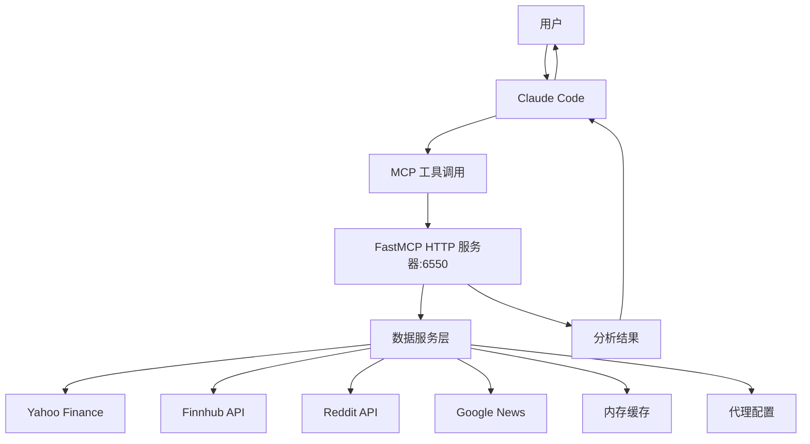
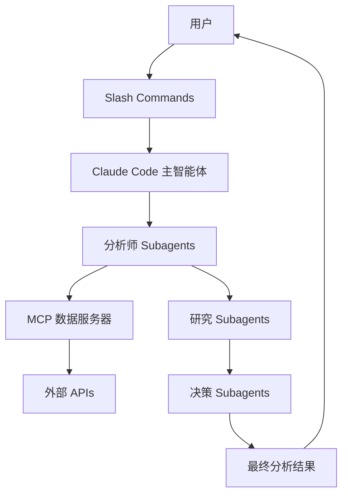

# TradingAgents Claude Code 架构设计

## ⚠️ 技术研究项目说明

> **本项目专门用于研究 Claude Code 技术架构，严禁任何投资用途！**
>
> - 🏗️ **架构学习**：深入理解 Claude Code 的 MCP、subagents、slash commands 架构设计
> - 📚 **教育目的**：展示现代 AI 平台的系统集成和多智能体协作模式
> - 🔬 **技术演示**：所有金融分析功能仅用于展示技术实现，不提供投资指导
> - ⚖️ **法律免责**：使用者须承担任何投资风险，开发者概不负责

## 架构概述

灵感来源于原 TradingAgents 项目的多智能体交易系统设计，在 Claude Code 环境中重新实现，利用 slash commands、subagents 和 MCP 服务器提供类似的交易分析功能。

> **实现状态说明**: ✅ **已完成核心实现**，包含 Yahoo Finance 市场数据、Finnhub 金融数据、Reddit 社交媒体、Google News 新闻等多个数据源的完整集成。技术指标计算、情绪分析、代理网络支持等功能已全部实现并正常工作。

## 1. 核心组件架构

### 1.1 MCP 服务器（数据层）

**trading-data-mcp**: 统一的金融数据访问服务器
```
功能模块：
- 市场数据（Yahoo Finance, Finnhub）
- 新闻数据（Google News, Reddit）
- 基本面数据（财务报表、内部交易）
- 技术指标（StockStats）
- 向量数据库（ChromaDB）
```

### 1.2 Subagents（智能体层）

#### 分析团队 Subagents
- **market-analyst**: 技术分析和市场趋势
- **fundamentals-analyst**: 财务报表和基本面分析
- **news-analyst**: 全球新闻和宏观经济分析
- **social-analyst**: 社交媒体情绪分析

#### 研究团队 Subagents
- **bull-researcher**: 看涨研究分析
- **bear-researcher**: 看跌研究分析
- **research-manager**: 研究总结和投资计划

#### 决策团队 Subagents
- **trader**: 交易决策合成
- **risk-manager**: 风险评估
- **portfolio-manager**: 投资组合管理

### 1.3 Slash Commands（用户接口层）

- `/trade-analyze [ticker] [date]`: 完整交易分析流程
- `/market-scan [sector]`: 市场扫描
- `/portfolio-review`: 投资组合评审
- `/risk-assessment [ticker]`: 风险评估
- `/backtest [strategy] [start] [end]`: 策略回测
- `/memory-train [results]`: 训练记忆系统

## 2. 数据流设计

### 2.1 当前实现架构


### 2.2 规划中的完整架构


## 3. 实现细节

### 3.1 MCP 服务器结构

```
tradingagents/
├── tradingagents/mcp/
│   ├── trading_server.py    # FastMCP HTTP 服务器入口
│   └── services/            # 各类数据服务
│       ├── market_data.py   # Yahoo Finance 市场数据
│       ├── finnhub_data.py  # Finnhub 金融数据
│       ├── news_feed.py     # Google News 新闻聚合
│       ├── reddit_data.py   # Reddit 社交媒体数据
│       ├── technical_indicators.py # 技术指标计算
│       └── proxy_config.py  # 代理配置服务
├── requirements.txt         # Python 依赖
├── .env.example            # 环境变量示例
└── start_server.sh         # 服务器启动脚本
```

### 3.2 Subagents 配置

项目包含 13 个专业 subagents，每个都有专门的配置文件：

```
.claude/agents/
├── analysts/ (4个分析师)
│   ├── market-analyst.md          # 技术分析专家
│   ├── fundamentals-analyst.md    # 基本面分析师
│   ├── news-analyst.md           # 新闻和宏观分析师
│   └── social-analyst.md         # 社交媒体情绪分析师
├── researchers/ (3个研究员)
│   ├── bull-researcher.md        # 看涨研究员
│   ├── bear-researcher.md        # 看跌研究员
│   └── research-manager.md       # 研究经理
└── decision/ (6个决策团队)
    ├── trader.md                 # 交易员
    ├── risk-manager.md          # 风险管理
    ├── portfolio-manager.md     # 投资组合管理
    ├── neutral-analyst.md       # 中性风险分析师
    ├── risky-analyst.md         # 激进风险分析师
    └── safe-analyst.md          # 保守风险分析师
```

**Subagents 特点**：
- 每个 agent 都有明确的专业领域和职责
- 自动激活机制 (MUST BE USED 条件)
- 与 MCP 工具集成，确保数据一致性
- 支持多轮协作和辩论机制

### 3.3 Slash Commands 实现

项目包含 6 个专业交易分析命令：

```
.claude/commands/
├── trade-analyze.md     # 完整交易分析流程 (核心命令)
├── market-scan.md       # 市场扫描和机会识别
├── portfolio-review.md  # 投资组合评审
├── risk-assessment.md   # 风险评估分析
├── backtest.md         # 策略回测
└── memory-train.md     # 记忆系统训练
```

**Commands 特点**：
- 每个命令都有完整的执行流程定义
- 强制使用 MCP 工具和专业 subagents
- 结构化输出格式，便于后续处理
- 支持参数化执行和批量处理

## 4. 核心功能映射

| 原 TradingAgents 功能 | Claude Code 实现 |
|-------------------|------------------|
| TradingAgentsGraph | Claude Code 主编排逻辑 |
| Agent Teams | Subagents 系统 |
| Toolkit 类 | MCP 服务器工具 |
| FinancialSituationMemory | MCP ChromaDB 集成 |
| LangGraph 工作流 | Claude Code 内置编排 |
| 配置系统 | settings.json + 环境变量 |

## 5. 配置管理

### 5.1 项目级配置 (.mcp.json)
```json
{
  "mcpServers": {
    "trading": {
      "type": "http",
      "url": "http://localhost:6550/mcp"
    }
  }
}
```

**实际配置说明**：
- **服务器类型**: HTTP 服务器（FastMCP Streamable HTTP）
- **协议**: HTTP/1.1 with Server-Sent Events (SSE)
- **端口**: 6550
- **路径**: `/mcp`
- **实现**: Python FastMCP 框架

### 5.2 环境变量配置
```bash
# .env
FINNHUB_API_KEY=your_key
REDDIT_CLIENT_ID=your_id
REDDIT_CLIENT_SECRET=your_secret
OPENAI_API_KEY=your_key
```

## 6. 工作流示例

### 6.1 完整交易分析流程

1. 用户执行 `/trade-analyze NVDA 2024-12-15`
2. Claude Code 调用分析师 subagents：
   - market-analyst 获取技术指标
   - fundamentals-analyst 分析财务数据
   - news-analyst 收集新闻
   - social-analyst 分析社交情绪
3. 研究团队辩论：
   - bull-researcher 提供看涨论点
   - bear-researcher 提供看跌论点
   - research-manager 总结投资计划
4. 交易决策：
   - trader 综合所有信息做出决策
   - risk-manager 评估风险
   - portfolio-manager 批准或拒绝
5. 返回最终决策给用户

### 6.2 实际使用流程（当前实现）

#### 启动 MCP 服务器
```bash
# 使用启动脚本
./start_server.sh

# 或直接启动
python -m tradingagents.mcp.trading_server
```

#### 在 Claude Code 中使用
```python
# 1. 系统健康检查
health_check()

# 2. 股票综合分析
analyze_stock_comprehensive("AAPL") 

# 3. 技术指标分析
technical_calculate_indicators("AAPL", ["RSI", "MACD"])

# 4. 新闻情绪分析
news_get_sentiment("AAPL")
reddit_get_sentiment_summary("AAPL")

# 5. 市场数据获取
market_get_quote("AAPL")
market_get_historical("AAPL", "3mo", "1d")
```

#### MCP 工具调用示例
- `mcp__trading__market_get_quote` - 实时股价
- `mcp__trading__technical_calculate_indicators` - 技术指标
- `mcp__trading__news_get_sentiment` - 新闻情绪
- `mcp__trading__reddit_get_sentiment_summary` - Reddit 情绪
- `mcp__trading__analyze_stock_comprehensive` - 综合分析

## 7. 开发计划

### ✅ 已完成功能
- [x] **MCP 服务器**: FastMCP HTTP 服务器，端口 6550
- [x] **数据源集成**: Yahoo Finance, Finnhub, Reddit, Google News
- [x] **技术指标**: RSI, MACD, 布林带, SMA, EMA 等
- [x] **异步处理**: 并行数据获取和处理
- [x] **缓存系统**: 智能 TTL 缓存减少 API 调用
- [x] **代理支持**: 企业网络环境完全支持
- [x] **健康检查**: 系统状态监控和诊断
- [x] **Subagents 实现**: 完整的分析师、研究员、决策团队 (13个专用 agents)
- [x] **Slash Commands**: `/trade-analyze`, `/market-scan`, `/backtest` 等 6个命令
- [x] **MCP 工具集**: 20个专业金融数据分析工具
- [x] **记忆系统**: SQLite 数据库记忆存储（相似案例检索、决策历史）

### 🔄 规划中功能 
- [ ] **向量数据库**: ChromaDB 集成（当前使用 SQLite 简单实现）
- [ ] **策略回测**: 完整回测引擎实现
- [ ] **风险管理**: VaR 计算和组合优化
- [ ] **实时执行**: 模拟交易和订单管理
- [ ] **高级分析**: 更复杂的量化分析模型

## 8. 技术栈

- **MCP 服务器**: Python, FastMCP 框架
- **数据源**: Yahoo Finance, Finnhub, Reddit, Google News
- **技术指标**: StockStats, pandas, numpy
- **网络请求**: aiohttp, asyncio (异步处理)
- **缓存**: 内存缓存 (TTL-based)
- **配置**: JSON, 环境变量 (.env)
- **代理支持**: HTTP/HTTPS 企业网络代理

## 9. 优势对比

| 特性 | 原 TradingAgents | Claude Code 实现 |
|------|--------------|-----------------|
| 部署复杂度 | 高（需要 Python 环境） | 低（集成在 Claude Code） |
| 可扩展性 | 需要修改代码 | 通过配置文件扩展 |
| 用户交互 | CLI/API | Slash commands |
| 智能体管理 | 代码定义 | 配置文件定义 |
| 数据访问 | Python 库 | MCP 标准化接口 |

## 10. 注意事项

1. **API 限流**: 实现请求缓存和限流机制
2. **数据一致性**: 确保所有 subagents 使用相同时间点的数据
3. **错误处理**: 完善的错误恢复机制
4. **安全性**: API 密钥的安全存储和访问控制
5. **性能**: 合理的并发控制和缓存策略